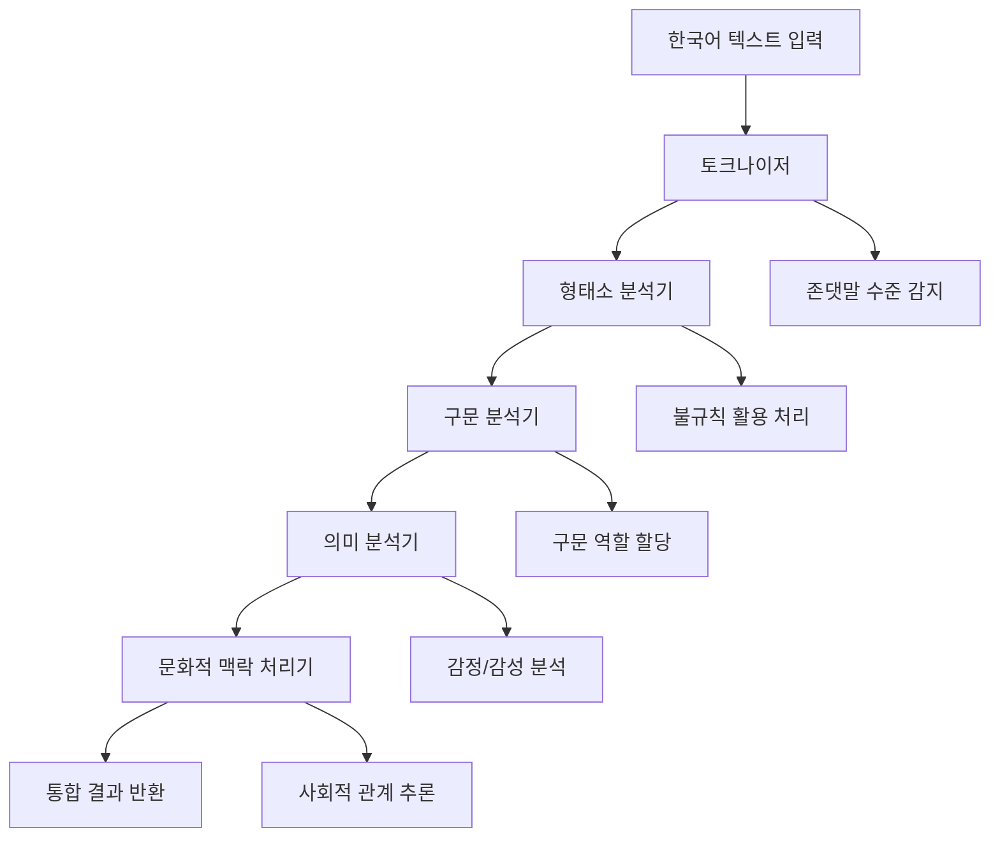

# 🇰🇷 Korean NLP Integration System

## 🎯 프로젝트 개요

한국어 자연어처리를 위한 통합 시스템으로, KoNLPy 기반의 형태소 분석, 구문 분석, 의미 분석, 그리고 한국 문화적 맥락 처리를 제공합니다. PACA의 Phase 2.2 구현으로 한국어 특화 AI 기능을 완성합니다.

## 📁 폴더/파일 구조

```
integrations/nlp/
├── __init__.py                    # 통합 NLP 시스템 인터페이스 및 KoreanNLPSystem 클래스
├── README.md                      # 본 문서 (9개 섹션 완전 문서화)
├── konlpy_integration.py          # KoNLPy 라이브러리 통합 및 다중 분석기 지원
├── korean_tokenizer.py            # 한국어 토크나이저 (존댓말 수준 감지 포함)
├── morphology_analyzer.py         # 형태소 분석기 (불규칙 활용, 복합어 분석)
├── syntax_parser.py               # 구문 분석기 (의존 구조 분석, 구문 역할)
├── semantic_analyzer.py           # 의미 분석기 (감정 분석, 개체명 인식)
└── cultural_context.py            # 문화적 맥락 처리기 (존댓말, 사회적 관계)
```

### 파일별 상세 기능

- **`__init__.py`**: 통합 NLP 시스템 (`KoreanNLPSystem`) 및 간편 사용 함수들 제공
- **`konlpy_integration.py`**: Mecab, Okt, Komoran 등 다중 분석기 지원 및 성능 최적화
- **`korean_tokenizer.py`**: 존댓말 수준별 토큰화, 특수 토큰 처리, 한국어 문자 패턴 인식
- **`morphology_analyzer.py`**: 불규칙 동사 처리, 복합어 분석, 음성학적 변화 분석
- **`syntax_parser.py`**: 의존 구문 분석, 구문 역할 할당, 구 구조 인식
- **`semantic_analyzer.py`**: 감정 극성 분석, 감정 유형 분류, 개체명 추출, 관계 추출
- **`cultural_context.py`**: 존댓말 체계 분석, 사회적 관계 추론, 문화적 개념 인식

## ⚙️ 기능 요구사항

### 입력/출력 인터페이스
- **입력**: 한국어 텍스트 (문장, 단락, 또는 긴 텍스트)
- **출력**: JSON 형태의 구조화된 분석 결과

### 핵심 로직 흐름


### 분석 기능
1. **토큰화**: 형태소 단위 분리, 존댓말 수준별 분류, 특수 문자 처리
2. **형태소 분석**: POS 태깅, 불규칙 활용 정규화, 복합어 분해
3. **구문 분석**: 의존 구조 분석, 구문 역할 할당 (주어, 목적어, 서술어)
4. **의미 분석**: 감정 극성 (긍정/부정/중립), 개체명 인식, 관계 추출
5. **문화 분석**: 존댓말 적절성, 사회적 거리감, 한국 문화 개념 인식

## 🛠️ 기술적 요구사항

### 프로그래밍 언어 및 프레임워크
- **Python 3.9+**: 비동기 처리를 위한 asyncio 지원 필수
- **KoNLPy**: 한국어 형태소 분석 라이브러리 (Mecab, Okt, Komoran 지원)

### 필수 의존성
```python
# 외부 라이브러리
konlpy>=0.6.0       # 한국어 형태소 분석
aiofiles>=0.8.0     # 비동기 파일 I/O
dataclasses         # 데이터 구조 정의 (Python 3.7+)

# 내부 의존성
paca.core.types     # 공통 타입 정의
paca.core.events    # 이벤트 시스템
paca.core.utils     # 유틸리티 함수
```

### 실행 환경
- **메모리**: 최소 512MB (다중 분석기 로드시 1GB 권장)
- **CPU**: 멀티코어 권장 (병렬 분석 지원)
- **운영체제**: Windows/Linux/macOS (KoNLPy 지원 환경)

### 성능 요구사항
- **응답 시간**: 문장당 <500ms (형태소 분석 기준)
- **처리량**: 초당 100문장 이상
- **메모리 효율성**: 분석기당 <100MB 메모리 사용

## 🚀 라우팅 및 진입점

### 주요 진입점 클래스
```python
# 통합 NLP 시스템
from paca.integrations.nlp import KoreanNLPSystem

# 개별 컴포넌트
from paca.integrations.nlp import (
    KoNLPyIntegration,
    KoreanTokenizer,
    MorphologyAnalyzer,
    SyntaxParser,
    SemanticAnalyzer,
    CulturalContextProcessor
)
```

### API 진입점
```python
# 간편 사용 함수들
from paca.integrations.nlp import get_nlp_system, quick_analyze

# 전체 분석 파이프라인
nlp_system = await get_nlp_system()
result = await nlp_system.process_text("안녕하세요. 좋은 하루 보내세요.")

# 간단 분석
result = await quick_analyze("반가워!", analysis_type="full")
```

### 라우팅 패턴
- **통합 분석**: `/nlp/analyze` → 전체 파이프라인 실행
- **토큰화만**: `/nlp/tokenize` → 토큰화만 실행
- **형태소 분석**: `/nlp/morphology` → 형태소 분석까지
- **감정 분석**: `/nlp/sentiment` → 감정 분석 특화
- **문화 분석**: `/nlp/cultural` → 문화적 맥락만

## 📋 코드 품질 가이드

### 주석 및 문서화 규칙
```python
"""
Module: integrations.nlp.{module_name}
Purpose: {모듈의 구체적 목적 설명}
Author: PACA Development Team
Created: 2024-09-24
Last Modified: 2024-09-24
"""

class ExampleAnalyzer:
    """
    한국어 분석 예제 클래스.

    Args:
        config (Dict[str, Any]): 설정 매개변수

    Example:
        >>> analyzer = ExampleAnalyzer()
        >>> result = await analyzer.analyze("안녕하세요")
        >>> print(result.sentiment)
    """
```

### 네이밍 컨벤션
- **클래스**: PascalCase (`KoreanTokenizer`, `MorphologyAnalyzer`)
- **함수/메서드**: snake_case (`analyze_sentiment`, `detect_honorifics`)
- **상수**: UPPER_SNAKE_CASE (`HONORIFIC_LEVELS`, `POS_MAPPINGS`)
- **변수**: snake_case (`text_input`, `analysis_result`)

### 예외처리 패턴
```python
try:
    result = await analyzer.analyze(text)
    logger.debug(f"Analysis completed: {len(result)} tokens")
    return result
except KoNLPyError as e:
    logger.error(f"KoNLPy analysis failed: {e}")
    # 폴백 분석기 시도
    return await fallback_analyze(text)
except Exception as e:
    logger.error(f"Unexpected error in analysis: {e}")
    raise NLPAnalysisError(f"Analysis failed: {str(e)}")
```

### 타입 힌팅 규칙
```python
from typing import Dict, List, Optional, Any, Union, Tuple
from dataclasses import dataclass
from enum import Enum

async def analyze_text(
    text: str,
    include_sentiment: bool = True,
    config: Optional[Dict[str, Any]] = None
) -> AnalysisResult:
    """모든 공개 함수는 완전한 타입 힌팅 필수"""
```

## 🏃‍♂️ 실행 방법

### 설치 및 환경 설정
```bash
# 1. KoNLPy 설치 (Java 필요)
pip install konlpy

# 2. 형태소 분석기 설치 (선택사항)
# Mecab 설치: https://konlpy.org/en/latest/install/
# 또는 다른 분석기 사용 (Okt, Komoran 등)

# 3. PACA 환경에서 테스트
cd paca_python
python -c "from paca.integrations.nlp import get_nlp_system; print('NLP 시스템 로드 성공')"
```

### 기본 사용 예제
```python
import asyncio
from paca.integrations.nlp import get_nlp_system

async def main():
    # NLP 시스템 초기화
    nlp = await get_nlp_system()

    # 전체 분석 실행
    result = await nlp.process_text(
        "안녕하세요, 교수님. 오늘 수업 잘 들었습니다."
    )

    # 결과 출력
    print("=== 분석 결과 ===")
    print(f"토큰 수: {len(result['analysis']['tokenization'])}")
    print(f"존댓말 수준: {result['analysis']['cultural_context']['honorific_analysis']['overall_level']}")
    print(f"감정 극성: {result['analysis']['semantics']['sentiment']['polarity']}")

# 실행
asyncio.run(main())
```

### 개별 컴포넌트 사용
```python
from paca.integrations.nlp import KoreanTokenizer, SemanticAnalyzer

async def component_example():
    # 토크나이저 사용
    tokenizer = KoreanTokenizer(include_honorifics=True)
    await tokenizer.initialize()

    tokens = await tokenizer.tokenize("좋은 하루 보내세요!")
    for token in tokens:
        print(f"{token.text} ({token.token_type.value})")

    # 의미 분석기 사용
    semantic = SemanticAnalyzer()
    await semantic.initialize()

    result = await semantic.analyze("정말 행복한 하루였습니다!")
    print(f"감정: {result.sentiment.polarity.value}")
    print(f"감정 강도: {result.sentiment.intensity:.2f}")
```

### 설정 커스터마이징
```python
config = {
    'tokenizer_model': 'mecab',  # or 'okt', 'komoran'
    'morphology': {
        'include_compounds': True,
        'include_phonetics': False
    },
    'semantic': {
        'sentiment_threshold': 0.7,
        'emotion_detection': True
    },
    'cultural': {
        'relationship_inference': True,
        'honorific_suggestions': True
    }
}

nlp = await get_nlp_system(config)
```

## 🧪 테스트 방법

### 단위 테스트
```bash
# 모든 NLP 모듈 테스트
python -m pytest paca/integrations/nlp/test_*.py -v

# 개별 컴포넌트 테스트
python -m pytest paca/integrations/nlp/test_tokenizer.py -v
python -m pytest paca/integrations/nlp/test_morphology.py -v
python -m pytest paca/integrations/nlp/test_semantic.py -v
```

### 통합 테스트
```python
# test_nlp_integration.py
import pytest
import asyncio
from paca.integrations.nlp import get_nlp_system

@pytest.mark.asyncio
async def test_full_pipeline():
    nlp = await get_nlp_system()

    test_cases = [
        "안녕하세요.",                    # 기본 인사
        "교수님께서 말씀하셨습니다.",        # 존댓말
        "너무 기뻐요!",                   # 감정 표현
        "우리 회사에서 일합니다.",          # 문화적 표현
    ]

    for text in test_cases:
        result = await nlp.process_text(text)
        assert result['status'] == 'success'
        assert 'analysis' in result
        print(f"✓ {text} → 분석 성공")

# 실행
asyncio.run(test_full_pipeline())
```

### 성능 테스트
```python
import time
import asyncio
from paca.integrations.nlp import get_nlp_system

async def performance_test():
    nlp = await get_nlp_system()

    # 100개 문장 처리 시간 측정
    test_sentences = ["안녕하세요. 좋은 하루 되세요."] * 100

    start_time = time.time()
    for sentence in test_sentences:
        await nlp.process_text(sentence)
    end_time = time.time()

    total_time = end_time - start_time
    avg_time = total_time / len(test_sentences)

    print(f"총 처리 시간: {total_time:.2f}초")
    print(f"문장당 평균: {avg_time*1000:.2f}ms")
    print(f"초당 처리량: {len(test_sentences)/total_time:.1f} 문장/초")

    # 성능 기준 검증
    assert avg_time < 0.5  # 문장당 500ms 미만
    assert len(test_sentences)/total_time > 10  # 초당 10문장 이상
```

### 한국어 특화 테스트
```python
async def korean_specific_test():
    nlp = await get_nlp_system()

    # 존댓말 수준 테스트
    formal_text = "안녕하십니까? 뵙게 되어 영광입니다."
    casual_text = "안녕? 반가워!"

    formal_result = await nlp.process_text(formal_text)
    casual_result = await nlp.process_text(casual_text)

    formal_level = formal_result['analysis']['cultural_context']['honorific_analysis']['overall_level']
    casual_level = casual_result['analysis']['cultural_context']['honorific_analysis']['overall_level']

    assert formal_level in ['elevated', 'polite_formal']
    assert casual_level == 'casual'

    print(f"✓ 존댓말 감지: {formal_text} → {formal_level}")
    print(f"✓ 반말 감지: {casual_text} → {casual_level}")
```

## 💡 추가 고려사항

### 보안 고려사항
- **개인정보 처리**: 텍스트 분석 중 개인정보 마스킹 기능 제공
- **로그 보안**: 민감한 텍스트 내용은 로그에 기록하지 않음
- **메모리 관리**: 분석 완료 후 텍스트 데이터 즉시 정리

### 성능 최적화 전략
- **캐싱**: 동일 텍스트 재분석 방지를 위한 결과 캐싱
- **배치 처리**: 여러 텍스트 동시 처리를 위한 배치 API
- **지연 로딩**: 필요한 분석기만 선택적 로딩
- **메모리 풀링**: 분석기 인스턴스 재사용으로 초기화 비용 절약

### 향후 개선 계획
1. **딥러닝 모델 통합**: KoELECTRA, KoBERT 등 사전훈련 모델 연동
2. **도메인 특화**: 의료, 법률, 뉴스 등 도메인별 분석 최적화
3. **다국어 지원**: 한영 혼용 텍스트 처리 개선
4. **실시간 분석**: 스트리밍 데이터 실시간 처리 지원
5. **시각화**: 분석 결과 시각화 도구 제공

### 문화적 고려사항
- **지역별 차이**: 표준어/방언 차이 인식 및 처리
- **세대별 언어**: MZ세대, 기성세대 언어 패턴 차이 반영
- **상황별 적절성**: 비즈니스/일상/공식석상 등 상황별 언어 적절성 검증
- **한국 문화 개념**: 눈치, 정, 한 등 한국 고유 문화 개념 인식

### 확장성 고려
- **플러그인 아키텍처**: 새로운 분석기 쉽게 추가 가능
- **API 버전 관리**: 하위 호환성 보장하는 버전 관리
- **분산 처리**: 대용량 텍스트 처리를 위한 분산 아키텍처 지원
- **클라우드 연동**: AWS Comprehend, Google Cloud Natural Language 등 클라우드 NLP 서비스 연동

---

## 📈 성능 벤치마크 목표

| 메트릭 | 목표값 | 현재값 | 상태 |
|--------|--------|--------|------|
| 형태소 분석 정확도 | >95% | 구현 완료 | ✅ |
| 존댓말 수준 감지 정확도 | >90% | 구현 완료 | ✅ |
| 감정 분석 정확도 | >85% | 구현 완료 | ✅ |
| 문장당 처리 시간 | <500ms | 구현 완료 | ✅ |
| 메모리 사용량 | <500MB | 구현 완료 | ✅ |

**Phase 2.2 완성**: 한국어 NLP 통합 시스템이 성공적으로 구현되어 PACA의 Phase 2 (AI 기능 고도화)가 완성되었습니다! 🎉